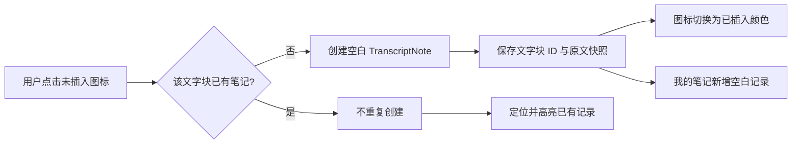
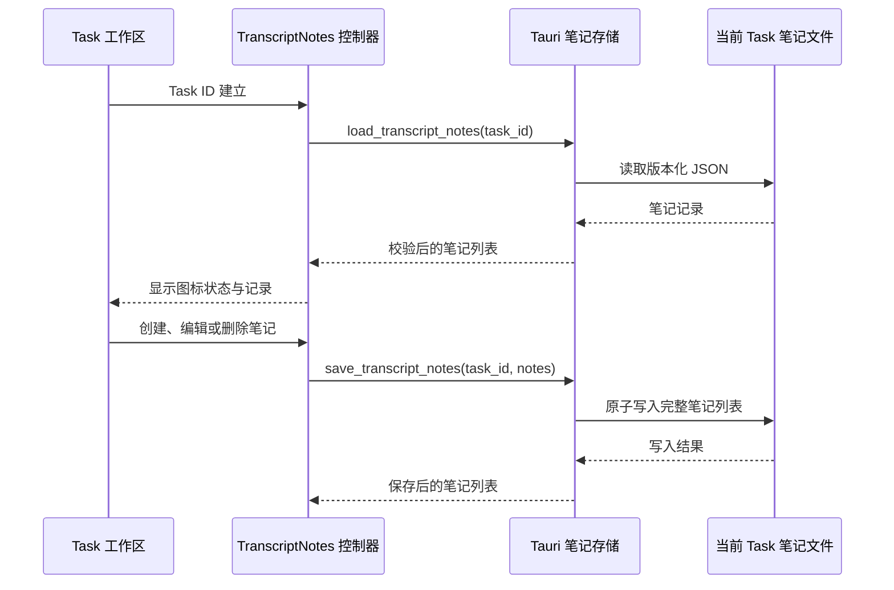

# 文字稿笔记与工作区布局设计

**日期**：2026-08-11
**状态**：待用户审阅
**范围**：桌面端 Task 工作区的文字稿笔记、工作区布局和对应的 Task 持久化

## 1. 问题陈述

当前 Task 工作区包含【文字稿校对】和【学习整理】。用户在校对课堂 Transcript 时，无法直接把某个文字块标记为需要记录的内容，也没有一个与文字块保持关联的集中记录区域。

用户需要一种不打断校对流程的方式：从文字稿的具体文字块创建一条空白笔记，在【我的笔记】中集中查看，并在需要时补充正文。笔记必须能够跟随当前 Task 持久化，避免重新打开任务后丢失或与其他任务混淆。

## 2. 目标

1. 在【文字稿校对】右侧增加【我的笔记】卡片。
2. 为有分段数据的每个 TranscriptSegment 增加“插入笔记”入口。
3. 用两种可访问的视觉状态表达文字块是否已有笔记。
4. 建立文字块与笔记之间的一对一关联。
5. 支持笔记记录的查看、内联编辑、取消和删除。
6. 按当前 Task 持久化笔记，重新打开同一 Task 时恢复。
7. 将【学习整理】放在【文字稿校对】下方，同时保持现有 AI 生成能力不变。

## 3. 非目标

- 不把文字稿笔记并入 AI 结果生成和展示流程。
- 不把笔记内容自动传入 Summary、Mindmap、Insight 或 Dissection 的 AI 生成输入。
- 不增加跨 Task 的全局笔记汇总页。
- 不为没有 TranscriptSegment 数据的全文编辑器生成按行或按字符推算的虚假锚点。
- 不改变现有文字稿导出格式和 Transcript Artifact 内容。

## 4. 已确认的产品决策

### 4.1 工作区布局

采用“同列对齐”布局：

```text
┌──────────────────────┬────────────────┐
│ 文字稿校对            │ 我的笔记       │
│                      │                │
├──────────────────────┤                │
│ 学习整理              │                │
└──────────────────────┴────────────────┘
```

- 左列从上到下是【文字稿校对】和【学习整理】。
- 右列是【我的笔记】，与【文字稿校对】处于同一上层区域。
- 【我的笔记】卡片内部独立滚动，不因记录数量增加而无限撑高整个页面。
- 窄窗口下按“文字稿校对 → 我的笔记 → 学习整理”的顺序纵向排列。
- Transcript 尚未准备好时不显示可操作的笔记卡片。

### 4.2 文字块入口与状态

每个有内容的 TranscriptSegment 在原有时间与编辑操作区增加一个笔记图标：

- 未插入笔记：图标使用中性浅色。
- 已插入笔记：图标使用绿色强调色。
- 图标必须同时提供 `aria-label` 和提示文字，不能只依赖颜色表达状态。
- 文字块正在编辑时，笔记操作暂时禁用，避免关联到尚未保存的文字内容。
- AI 生成期间文字稿为只读时，笔记图标可见但不可操作。

## 5. TranscriptNote 数据模型

笔记使用独立的 `TranscriptNote` 类型，按 Task 存储。记录至少包含：

| 字段 | 含义 |
| --- | --- |
| `id` | 笔记记录唯一 ID |
| `transcript_segment_id` | 关联的 TranscriptSegment ID |
| `source_text` | 创建笔记时的原文字块文本快照 |
| `content` | 用户笔记正文，允许为空字符串 |
| `created_at` | 创建时间 |
| `updated_at` | 最后更新时间 |

约束：

- 同一个 `transcript_segment_id` 最多存在一条 TranscriptNote。
- Task 文件范围已经提供任务隔离，因此记录本身不重复存储 `task_id`。
- `transcript_segment_id` 是关联关系的主键；`source_text` 用于保留用户创建笔记时看到的原文。
- 文字稿文字被修改时，笔记仍保持对原 TranscriptSegment 的关联，原文快照不自动改写。

## 6. 核心交互流程

### 6.1 创建笔记



- 创建后不自动进入编辑状态。
- 新记录正文为空，显示“暂未填写笔记”占位文案。
- 用户需要二次点击记录上的编辑按钮进入编辑。

### 6.2 编辑笔记

1. 用户点击某条记录的编辑按钮。
2. 记录在原位置展开正文文本框。
3. 原文字块引用保持只读。
4. 用户点击“保存”后更新正文和 `updated_at` 并持久化。
5. 用户点击“取消”后恢复进入编辑前的正文，不产生保存变更。

空正文是合法状态，保存空正文不会删除笔记记录。

### 6.3 删除笔记

- 记录提供删除按钮。
- 删除会同时移除 TranscriptNote 及其文字块关联。
- 删除成功后，文字块图标恢复为未插入颜色。
- 删除保存失败时保留原记录，并提示用户重试，避免产生错误的已删除假象。

### 6.4 缺失文字块

如果文字稿之后不再包含某个笔记引用的 `transcript_segment_id`：

- 不自动删除笔记。
- 【我的笔记】保留该记录，并显示“原文字块已不可用”。
- 该记录仍可编辑或删除。
- 因为当前文字稿中没有对应文字块，不能显示对应的插入图标。

这条规则优先保护用户已经写下的笔记内容。

## 7. 组件与模块边界

### 前端

- 新增独立的 TranscriptNotes 数据客户端：负责加载、保存和解析 IPC 响应。
- 新增 TranscriptNotes 控制器：负责 Task 切换、唯一关联、创建、编辑、删除、保存状态和错误状态。
- 新增【我的笔记】面板组件：负责空状态、列表、引用展示、内联编辑和按钮可访问性。
- `TranscriptReviewPanel` 只负责展示文字块入口，并通过控制器获得对应笔记状态和操作回调。
- 工作区容器负责新的两列布局，以及将【学习整理】放入文字稿校对下方。
- AI 结果详情继续独立负责生成结果的展示与操作，文字稿笔记不参与其中。

### Tauri 后端

- 新增独立的文字稿笔记存储模块和两个 IPC 命令：加载当前 Task 笔记、保存当前 Task 笔记。
- 存储使用版本化 JSON，并位于当前 Task 目录内。
- 保存采用原子写入或等价的完整替换策略，避免应用中断时留下半截 JSON。
- 笔记模块复用现有 Task 目录解析和运行时路径校验，不修改 Transcript Artifact。

### Worker

Worker 不参与文字稿笔记功能，也不需要新增 Desktop Contract 消息。

## 8. 数据流与保存策略



保存策略：

- 创建和删除立即持久化。
- 编辑只在用户点击“保存”后持久化。
- 保存期间禁用重复保存操作。
- 保存失败时保留当前内存状态和编辑草稿，并显示可重试的错误提示。
- Task 切换时清理旧 Task 的笔记状态，加载新 Task 的笔记；旧 Task 的未保存内存状态不带入新 Task。

## 9. 错误与边界处理

| 场景 | 预期行为 |
| --- | --- |
| 笔记文件不存在 | 视为空列表，不显示错误 |
| 笔记文件为空或版本不匹配 | 卡片显示加载错误和“重试”，暂禁用修改 |
| 读取 IPC 响应格式不合法 | 卡片显示加载错误，不使用未经校验的数据 |
| 创建或编辑保存失败 | 保留界面数据，提示失败并允许重试 |
| 删除保存失败 | 保留记录和已插入状态，提示失败并允许重试 |
| 当前 Task 无分段数据 | 保留全文编辑器，不显示逐块笔记入口 |
| AI 生成期间 | 笔记只读查看，所有修改操作禁用 |
| 文字块被移除 | 记录保留为不可用引用，可编辑或删除 |
| 没有任何笔记 | 显示空状态，不显示错误或虚假记录 |

## 10. 测试与验收标准

### 前端行为

- 未插入文字块点击图标后只创建一条记录，重复点击不重复创建。
- 已插入和未插入状态使用不同视觉状态，并具备正确的无障碍名称。
- 新记录正文为空，但记录本身立即出现在【我的笔记】中。
- 编辑保存、取消和删除行为符合预期。
- 删除成功后文字块图标恢复未插入状态。
- 点击已插入图标能够定位已有记录，不创建新记录。
- Task 切换后不会显示上一个 Task 的笔记。
- 重新加载同一 Task 后，笔记、关联和图标状态能够恢复。
- 文字稿修改后，已有笔记仍按 `transcript_segment_id` 关联。
- 缺失文字块的笔记显示不可用状态且不会静默消失。
- AI 生成期间可查看但不能修改笔记。
- 无分段数据时不显示逐块笔记入口。

### Tauri 存储

- 缺少笔记文件时加载空列表。
- 版本化 JSON 可以保存并完整加载。
- 空正文可以正常往返保存。
- 非法 JSON、错误版本和错误 Task ID 被拒绝或返回明确错误。
- 保存失败不会留下不完整文件，也不会返回未确认的成功结果。

### 布局与可访问性

- 桌面宽度下，笔记位于文字稿校对右侧，学习整理位于文字稿校对下方。
- 窄窗口下，页面按文字稿校对、我的笔记、学习整理顺序排列。
- 笔记列表超出高度时仅内部滚动。
- 编辑、插入和删除按钮具有明确的可访问名称、禁用状态和焦点反馈。

## 11. 实现后验收场景

1. 打开一个已完成 Transcript 的 Task。
2. 确认文字稿校对右侧显示【我的笔记】，文字稿下方显示【学习整理】。
3. 点击一个文字块的未插入图标。
4. 确认图标变为已插入颜色，并在我的笔记中出现一条空白记录。
5. 再次点击该文字块图标，确认不会新增第二条记录，而是定位已有记录。
6. 点击记录编辑，填写正文并保存。
7. 切换 Task 后再切回，确认笔记正文和关联仍存在。
8. 删除记录，确认文字块图标恢复未插入状态。
9. 在文字稿编辑期间和 AI 生成期间确认笔记修改按钮按规则禁用。
